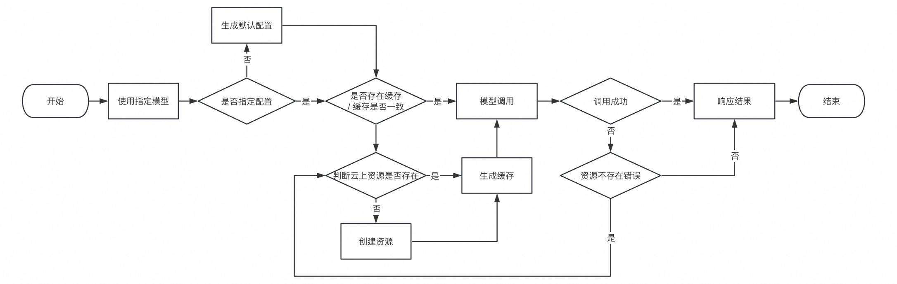

# 项目原理

## 基础介绍

DipperAI 意在通过提供一种垂直领域模型/纵身领域模型开箱即用的能力，期望用户可以从 Modelscope，Huggingface 等平台获得到模型地址后就可以直接进行使用，而无需手动部署或构建 Model RESTFul API 服务。

## 工作流程

DipperAI Framework 整体工作流程如下：



1. 当用户在 Modelscope，Huggingface 等平台获得到模型地址后，可以直接在项目中进行导入，并传入对应参数，例如：
```python
from dipperai.maas import modelscope
model_url = "https://modelscope.cn/models/iic/cv_resnet18_card_correction/summary"
ocr = modelscope(model_url, local=True).run("image url")
```

2. 框架会在首次执行时，进行相对应的资源部署，并生成 `./.cache/dipperai.json` 文件，作为项目的缓存文件，即在此执行时，系统会优先读取该文件中存在的配置和部署信息，进行模型调用；

> 基于上述 1-2 流程，可能出现的异常情况以及对应的解决方案：
>
> 1. 模型已经完成部署，但是生成的 `./.cache/dipperai.json` 文件不存在，或者格式出现错误，导致框架无法获取模型信息。此时框架会进行云上资源获取以判断资源是否存在，且配置是否为预期配置，如果不存在则创建，如果配置不符合预期则进行调整，并重置缓存模块；
> 2. 用户完成代码编写之后，首次执行时，可能会涉及到大量模型的创建导致首次调用时间过长，甚至可能超出所提供 RESTFul API 的 timeout 配置，此时用户可以在自身应用部署之前手动执行 `dipperai up` 命令，提前拉起对应资源，即在程序运行时直接进行调用操作；


## 技术选型

开发语言：Python

项目以 Python 语言作为开发语言，主要考虑：
1. 项目主要针对 AI 场景，而在 AI 场景中，Python 用户居多，所以最终选择以 Python 语言做为项目开发语言；
2. Python 语言相对轻量化，且上手简单，对于该项目的 0-1 是比较容易实现的，所以会优先考虑以 Python 语言作为开发语言进行推进；

> 额外探索：如何支持多语言？即可以用 Node.js，Golang 等不同的编程语言使用该框架？    在未来，将会把该框架以服务化的形式进行提供，并且针对不同的编程语言，提供轻量化的依赖包。

部署架构：Serverless 架构

该项目推荐将模型部署到 Serverless 架构以尽可能的获得成本与性能的平衡，使用 Serverless 架构的优势：
1. Serverless 架构通常情况下是按量付费的，且可以缩容到 0 ，这就意味着在不进行模型调用时，基本不会产生费用，只有在进行模型调用时才会产生费用；
2. Serverless 架构本身就是一种轻量化的架构，其天然分布式的特点让这种短平快的架构具有更好的性能，更高的可拓展能力，而本项目所部署的模型服务通常情况下都是轻量化的垂类模型，所以优先选择 Serverless 架构；

> 额外探索：是否可以部署到其他架构？在项目设计之初，就考虑了模型服务的可拓展性，无论是支持的模型托管平台，还是部署平台，都可以可以通过提 PR 进行快速拓展的。其中模型平台主要代码存放在 `./maas/` 目录，部署平台的代码主要存放在 `./vendor` 目录。
