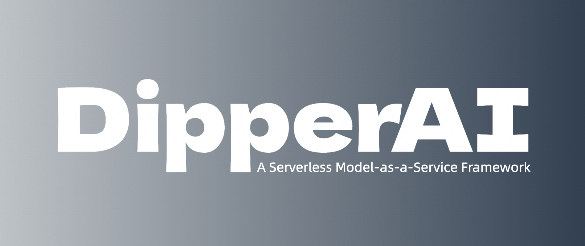

# DipperAI: A Serverless Model-as-a-Service Framework

<p align="center" style="color: red">Coming soon ...</p>



<p align="center">English ｜ <a href="./readme_zh.md">中文</a></p>

## Introduction
In the rapidly evolving field of artificial intelligence, the process of developing and deploying models is often complex and time-consuming. DipperAI aims to significantly simplify this process through a sleek and powerful serverless architecture framework. It allows developers and data scientists to directly find, initialize, and call machine learning models from model repositories like Hugging Face and ModelScope, without the hassle of downloading, deploying, or maintaining the models.

## Core Features
- **Seamless Integration**: DipperAI supports seamless integration with major model repositories, enabling users to access and run thousands of pre-trained models directly via URLs.
- **Instant Usage**: Leveraging serverless architecture, it eliminates the need for server setup or management, enabling instant model usage and automatic scaling.
- **Simplified API**: Offers a simple and intuitive Python API, making the entire process from model selection to deployment straightforward for users.
- **Flexibility and Scalability**: Allows users to configure model parameters and choose the cloud platform and geographic location for model execution, optimizing performance and costs.
- **Open Source and Community-Driven**: The DipperAI project encourages open-source contributions, fostering an active community for knowledge sharing and technical collaboration.

## Usage Example

```python
from dipperai.maas import Modelscope
model_url = "https://modelscope.cn/models/iic/cv_resnet18_card_correction/summary"
ocr = Modelscope(model_url).invoke("image url")
```

## Why Choose DipperAI
- **Development Efficiency**: Significantly reduces the time from model selection to deployment, accelerating project iteration speed.
- **Cost-Effectiveness**: Minimizes resource wastage through serverless architecture, with pay-as-you-go pricing.
- **Ease of Use**: Simplified API and documentation make using machine learning models easier than ever.
- **Flexibility**: Seamless support for a variety of models and cloud platforms, offering maximum flexibility and scalability for projects.

## Getting Started
Visit the [official documentation](https://www.dipperai.cn) to start using DipperAI. Join our community to build the future of AI solutions together.

## Join Us
DipperAI is committed to creating the most advanced model-as-a-service platform, and we welcome all individuals and teams passionate about AI to join us. Whether through contributing code, providing feedback, or sharing best practices, your participation is our motivation to keep moving forward.
