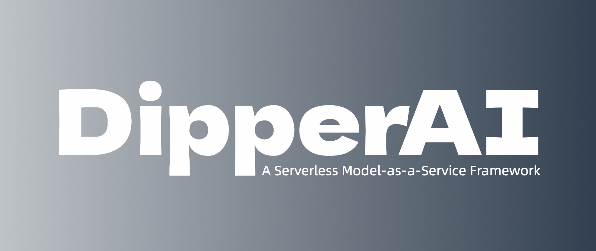

# DipperAI: 无服务器架构下的模型即服务框架



## 简介

在快速演进的人工智能领域，模型的开发和部署过程往往复杂且耗时。DipperAI 旨在通过一个简洁强大的无服务器 (Serverless) 架构框架，极大地简化这一过程。它允许开发者和数据科学家直接从模型库（如HuggingFace和ModelScope）中找到、初始化并调用机器学习模型，无需关心模型的下载、部署或维护等繁琐步骤。

## 核心特性
- **无缝集成**：DipperAI 支持与主流模型库的无缝集成，让用户能够直接通过URL访问和运行数以千计的预训练模型。
- **即时使用**：基于 Serverless 架构，用户无需设置或管理服务器，即可实现模型的即时使用和自动扩展。
- **简化API**：提供简单直观的 Python API，使得从模型选择到部署的整个过程，对于用户来说既简单又直接。
- **灵活性和可扩展性**：允许用户根据需要配置模型参数，以及选择执行模型的云平台和地理位置，从而优化性能和成本。
- **开源和社区驱动**：DipperAI 项目鼓励开源贡献，建立了一个活跃的社区，促进知识分享和技术协作。

## 使用示例

```python
from dipperai.maas import modelscope
model_url = "https://modelscope.cn/models/iic/cv_resnet18_card_correction/summary"
ocr = modelscope(model_url, local=True).run("image url")
```

## 为何选择DipperAI
- **开发效率**：显著减少从模型选择到部署的时间，加速项目的迭代速度。
- **成本效益**：通过无服务器架构减少资源浪费，按需付费。
- **易用性**：简化的 API 和文档，使得机器学习模型的使用变得前所未有的容易。
- **灵活性**：无缝支持多种模型和云平台，为项目提供最大的灵活性和可扩展性。

## 快速上手
请访问[官方文档](https://docs.dipperai.cn)开始使用DipperAI，加入我们的社区，一起构建未来的AI解决方案。

## 加入我们
DipperAI 致力于打造最先进的模型即服务平台，我们欢迎所有对 AI 充满热情的个人和团队加入我们。无论是通过贡献代码、提供反馈，还是分享最佳实践，您的参与都是我们不断前进的动力。